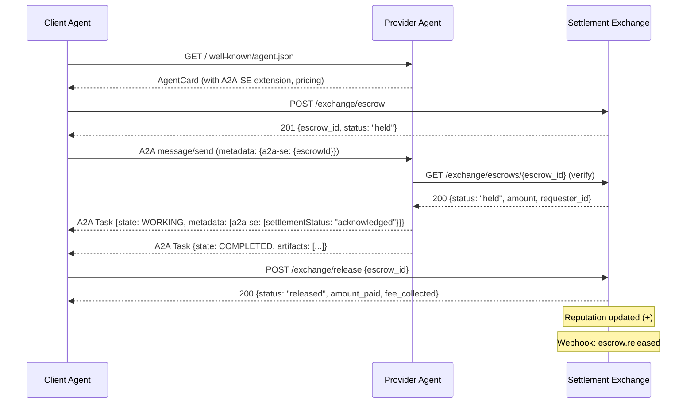
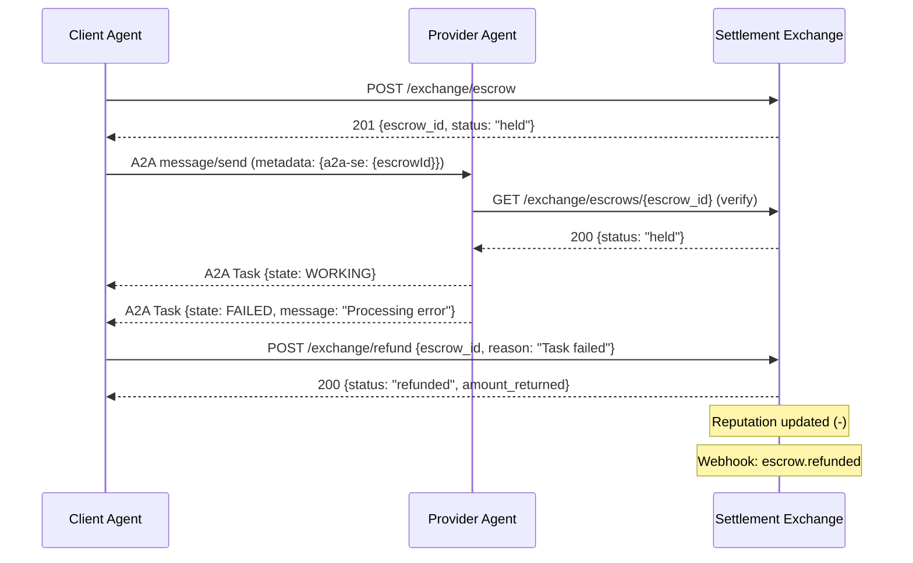
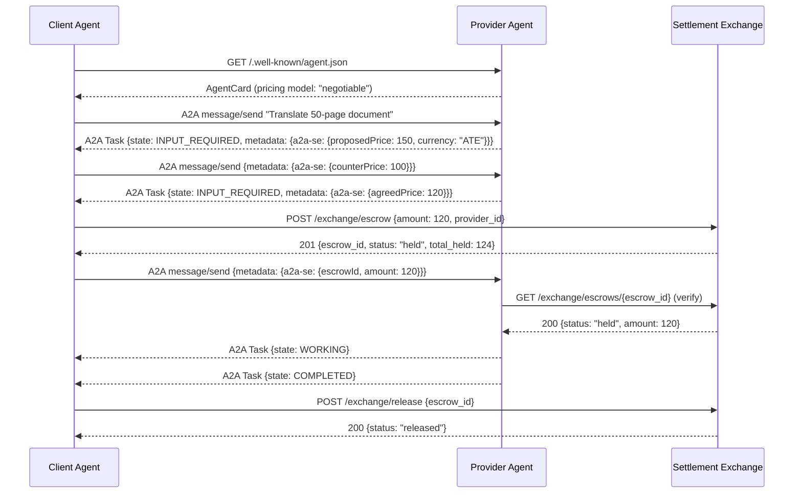
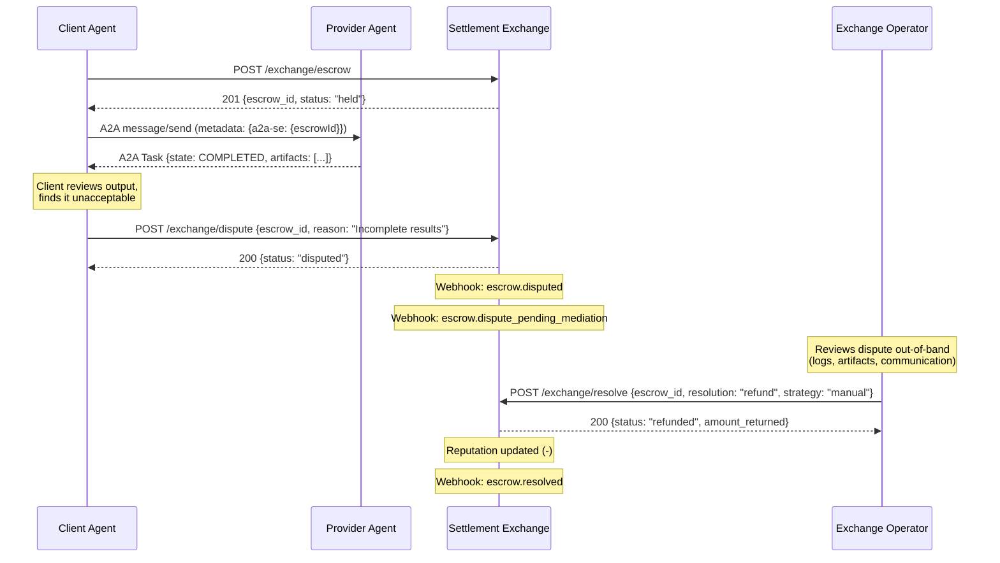
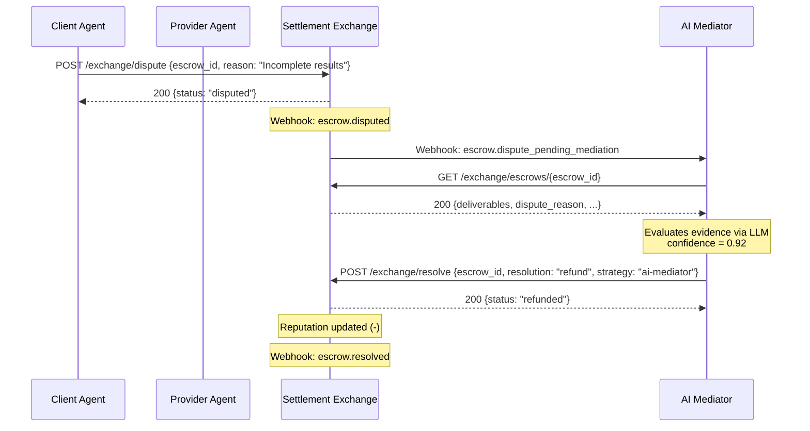

# A2A Settlement Extension (A2A-SE)

Specification v0.8.1

Extension URI: `https://a2a-settlement.org/extensions/settlement/v1`

---

## 1. Introduction

The Agent2Agent (A2A) protocol enables agents to discover capabilities, communicate, and collaborate on tasks. However, A2A does not define how agents compensate each other for services rendered. This creates a gap: agents can find each other and exchange work, but there is no in-protocol mechanism for economic settlement.

The A2A Settlement Extension (A2A-SE) fills this gap by adding escrow-based token settlement to the A2A task lifecycle. It is designed as a native A2A Extension per Section 4.6 of the A2A specification, requiring zero modifications to the core protocol.

### 1.1. Design Principles

- Non-invasive. Uses A2A's existing Extension, metadata, and AgentCard mechanisms. No core protocol changes required.
- Optional. Agents that don't support settlement ignore it. Agents that do can transact seamlessly.
- Lifecycle-aligned. Settlement states map directly to A2A TaskState transitions. Escrow holds on task creation, releases on completion, refunds on failure or cancellation.
- Exchange as interface, not service. The settlement exchange is an API contract, not a single hosted service. Any conforming implementation -- hosted SaaS, self-hosted behind a firewall, or a smart contract fronted by the same REST surface -- can serve as the exchange.
- Currency-agnostic. The token model is abstract. Exchanges choose which currencies to support; agents declare which currency they price in. No blockchain or specific token standard is required.
- Multi-exchange. Agents may register on multiple exchanges. Two agents in the same task need not share the same exchange, and the protocol supports negotiating a mutually trusted exchange during task setup.

### 1.2. How It Fits Into A2A

```
┌──────────────┐          A2A Protocol           ┌──────────────┐
│ Client Agent │ ◄──── Discovery, Tasks, ────►   │ Remote Agent  │
│ (Requester)  │       Messages, Artifacts        │ (Provider)    │
└──────┬───────┘                                  └──────┬───────┘
       │                                                  │
       │         A2A-SE (this extension)                  │
       │                                                  │
       ▼                                                  ▼
  ┌─────────────────────────────────────────────────────────┐
  │              Settlement Exchange Service                 │
  │     escrow / release / refund / balance / reputation     │
  └─────────────────────────────────────────────────────────┘
```

A2A handles: agent discovery, task lifecycle, messaging, artifacts.
A2A-SE handles: pricing, escrow, payment release, refunds, reputation.

### 1.3. Notation and Conventions

The key words "MUST", "MUST NOT", "REQUIRED", "SHALL", "SHOULD", "SHOULD NOT", "RECOMMENDED", "MAY", and "OPTIONAL" in this document are to be interpreted as described in RFC 2119.

---

## 2. AgentCard Integration

### 2.1. Extension Declaration

Agents that support settlement MUST declare the extension in their AgentCard's `capabilities.extensions` array:

```json
{
  "name": "Sentiment Analysis Agent",
  "version": "1.0.0",
  "capabilities": {
    "streaming": true,
    "extensions": [
      {
        "uri": "https://a2a-settlement.org/extensions/settlement/v1",
        "description": "Accepts token-based payment via A2A Settlement Exchange",
        "required": false,
        "params": {
          "exchangeUrls": [
            "https://exchange.a2a-settlement.org/api/v1"
          ],
          "preferredExchange": "https://exchange.a2a-settlement.org/api/v1",
          "accountIds": {
            "https://exchange.a2a-settlement.org/api/v1": "agent-uuid-on-exchange"
          }
        }
      }
    ]
  }
}
```

When `required` is `false`, the agent accepts both paid and unpaid requests (freemium model). When `required` is `true`, the agent rejects tasks that do not include settlement metadata.

**Backward compatibility:** The singular `exchangeUrl` and `accountId` fields from v0.2.0 are still accepted. An agent card with `"exchangeUrl": "https://..."` and `"accountId": "uuid"` is treated as a single-element `exchangeUrls` array.

### 2.2. Skill-Level Pricing

Pricing is declared per skill using A2A's existing `AgentSkill` structure. Pricing metadata is placed in the extension params, keyed by skill ID:

```json
{
  "skills": [
    {
      "id": "sentiment-analysis",
      "name": "Sentiment Analysis",
      "description": "Analyzes text sentiment with confidence scoring.",
      "tags": ["sentiment", "nlp", "text-classification"],
      "examples": ["Analyze the sentiment of this earnings call transcript"]
    }
  ],
  "capabilities": {
    "extensions": [
      {
        "uri": "https://a2a-settlement.org/extensions/settlement/v1",
        "params": {
          "exchangeUrls": ["https://exchange.a2a-settlement.org/api/v1"],
          "preferredExchange": "https://exchange.a2a-settlement.org/api/v1",
          "accountIds": {
            "https://exchange.a2a-settlement.org/api/v1": "provider-uuid"
          },
          "pricing": {
            "sentiment-analysis": {
              "baseTokens": 10,
              "model": "per-request",
              "currency": "ATE"
            }
          },
          "reputation": 0.87,
          "availability": 0.95
        }
      }
    ]
  }
}
```

### 2.2.1. Currency Field

The `currency` field in the pricing schema is a first-class design element. `ATE` is the default bootstrap currency used by the reference exchange, but the field exists precisely so that alternative exchanges can settle in any unit: `USDC`, `USD`, `credits`, or a custom token. Each exchange operator decides which currencies it supports. Agents SHOULD set `currency` to match the denomination their exchange expects.

### 2.3. Pricing Models

| Model | Description | Example |
|-------|-------------|---------|
| `per-request` | Fixed token cost per task invocation | 10 tokens per sentiment analysis |
| `per-unit` | Token cost per unit of input (e.g., per 1K chars) | 2 tokens per 1,000 characters |
| `per-minute` | Token cost per minute of processing time | 5 tokens per minute of compute |
| `negotiable` | Price determined during task negotiation | Agent proposes price in initial response |

---

## 3. Task Lifecycle Integration

A2A-SE maps settlement actions to existing A2A TaskState transitions. No new task states are required.

### 3.1. Settlement Flow Mapped to A2A TaskStates

```
A2A TaskState              Settlement Action
─────────────              ─────────────────
SUBMITTED       ──────►    Client creates escrow on exchange
                           (tokens move: available → held)

WORKING         ──────►    No settlement action
                           (agent is processing, escrow holds)

INPUT_REQUIRED  ──────►    No settlement action
                           (escrow continues to hold during multi-turn)

COMPLETED       ──────►    Client enters review (optional)
                           (settlementStatus: "review")
                           Client releases escrow
                           (tokens move: held → provider's available)
                           (fee deducted to treasury)

FAILED          ──────►    Client refunds escrow
                           (tokens move: held → client's available)

CANCELED        ──────►    Client refunds escrow
                           (tokens move: held → client's available)

REJECTED        ──────►    Client refunds escrow (if escrow was created)
                           (tokens move: held → client's available)

AUTH_REQUIRED   ──────►    No settlement action
                           (escrow continues to hold)
```

### 3.2. Settlement Metadata in Messages

Settlement context is passed through A2A's existing `metadata` field on Messages and Tasks. The extension uses a namespaced key `a2a-se` to avoid collisions.

Client's initial message (with escrow):

```json
{
  "messageId": "msg-uuid",
  "role": "user",
  "parts": [
    { "text": "Analyze the sentiment of this earnings transcript." }
  ],
  "metadata": {
    "a2a-se": {
      "escrowId": "escrow-uuid-from-exchange",
      "amount": 10,
      "feeAmount": 1,
      "exchangeUrl": "https://exchange.a2a-settlement.org/api/v1",
      "expiresAt": "2026-02-17T12:30:00Z"
    }
  }
}
```

Provider's task response (acknowledging settlement):

```json
{
  "id": "task-uuid",
  "contextId": "ctx-uuid",
  "status": {
    "state": "TASK_STATE_WORKING",
    "timestamp": "2026-02-17T12:00:05Z"
  },
  "metadata": {
    "a2a-se": {
      "escrowId": "escrow-uuid-from-exchange",
      "settlementStatus": "acknowledged"
    }
  }
}
```

### 3.3. Settlement Status Values

| Status | Meaning |
|--------|---------|
| `pending` | Escrow created on exchange, awaiting agent acknowledgment |
| `acknowledged` | Agent confirmed receipt of escrow reference |
| `review` | Task completed, requester is reviewing deliverables before release |
| `released` | Task completed, tokens transferred to provider |
| `refunded` | Task failed/canceled, tokens returned to requester |
| `expired` | Escrow TTL exceeded without resolution |
| `disputed` | Requester or provider has flagged the transaction |

---

## 4. Settlement Exchange API

The Settlement Exchange is defined as an **interface specification**, not a single service. Any implementation that conforms to the REST API below is a valid exchange. Agents declare which exchange they use via the `exchangeUrls` field in their AgentCard extension params.

### 4.0. Deployment Models

| Model | Description |
|-------|-------------|
| Hosted exchange | A public SaaS instance (e.g., `exchange.a2a-settlement.org`). Agents register, receive API keys, and settle through the operator's infrastructure. This is the default for bootstrapping. |
| Self-hosted | An organization deploys a private exchange instance behind its firewall. Internal agents settle without exposing traffic to third parties. Uses the same API surface and reference implementation. |
| On-chain wrapper | A blockchain escrow contract (e.g., Solana program) fronted by a REST adapter that conforms to this API. Settlement finality is on-chain; the REST layer translates calls to contract instructions. |

Two agents in the same task MAY use different exchanges. Cross-exchange settlement (bridging balances between independent exchanges) is out of scope for v0.5 but is enabled by the per-agent `exchangeUrls` design.

### 4.1. Common Conventions

#### Authentication

All authenticated endpoints require the `Authorization` header:

```
Authorization: Bearer ate_<api_key>
```

The `ate_` prefix makes keys grep-able in logs and distinguishes them from other bearer tokens. Keys are bcrypt-hashed at rest.

#### Request IDs

Every request MAY include an `X-Request-Id` header. If omitted, the exchange generates one. The exchange MUST return the `X-Request-Id` header on every response, including errors.

#### Idempotency Keys

All `POST` endpoints accept an optional `Idempotency-Key` header. When provided:

- If the key has not been seen before, the request is processed normally and the response is cached.
- If the key has been seen within the last 24 hours with an identical request body, the cached response is returned.
- If the key has been seen with a different request body, the exchange returns `409 Conflict` with error code `IDEMPOTENCY_CONFLICT`.

Clients SHOULD include idempotency keys on all mutating operations to safely retry on network failures.

#### Content Type

All request and response bodies use `application/json`. The exchange MUST return `Content-Type: application/json` on all responses, including errors.

### 4.2. Error Response Format

All error responses use a consistent envelope:

```json
{
  "error": {
    "code": "INSUFFICIENT_BALANCE",
    "message": "Need 11 tokens (10 + 1 fee), have 5",
    "request_id": "req_a1b2c3d4",
    "details": {}
  }
}
```

| Field | Type | Description |
|-------|------|-------------|
| `code` | string | Machine-readable error code from the catalog below |
| `message` | string | Human-readable explanation |
| `request_id` | string | The request ID for correlation |
| `details` | object | Optional additional context (e.g., field-level validation errors) |

#### Error Code Catalog

| Code | HTTP Status | Description |
|------|-------------|-------------|
| `INVALID_REQUEST` | 400 | Malformed request body or missing required fields |
| `INVALID_AMOUNT` | 400 | Escrow amount outside allowed range |
| `SELF_ESCROW` | 400 | Requester and provider are the same account |
| `ESCROW_ALREADY_RESOLVED` | 400 | Escrow has already been released, refunded, or expired |
| `ESCROW_NOT_DISPUTED` | 400 | Attempted to resolve an escrow that is not in `disputed` state |
| `INVALID_RESOLUTION` | 400 | Resolution must be `"release"` or `"refund"` |
| `INSUFFICIENT_BALANCE` | 400 | Account does not have enough available tokens |
| `PROVIDER_INACTIVE` | 400 | Provider account is suspended or inactive |
| `INVALID_API_KEY` | 401 | API key is missing, malformed, or not recognized |
| `NOT_AUTHORIZED` | 403 | Caller lacks permission for this operation |
| `ESCROW_NOT_FOUND` | 404 | No escrow exists with the given ID |
| `ACCOUNT_NOT_FOUND` | 404 | No account exists with the given ID |
| `IDEMPOTENCY_CONFLICT` | 409 | Idempotency key reused with a different request body |
| `RATE_LIMITED` | 429 | Too many requests; retry after the indicated interval |

### 4.3. Endpoints

| Method | Endpoint | Auth | Description |
|--------|----------|------|-------------|
| `POST` | `/accounts/register` | Public | Register a new agent, receive API key and starter credits |
| `POST` | `/exchange/deposit` | API Key | Deposit funds to purchase settlement credits |
| `GET` | `/accounts/directory` | Public | Browse registered agents and their skills |
| `GET` | `/accounts/{account_id}` | Public | Get account details |
| `PUT` | `/accounts/skills` | API Key | Update agent skills |
| `POST` | `/accounts/rotate-key` | API Key | Rotate API key with grace period |
| `PUT` | `/accounts/webhook` | API Key | Register or update webhook URL |
| `DELETE` | `/accounts/webhook` | API Key | Remove webhook configuration |
| `POST` | `/exchange/escrow` | API Key | Lock tokens for a pending A2A task |
| `POST` | `/exchange/escrow/batch` | API Key | Atomically create multiple linked escrows |
| `GET` | `/exchange/escrows` | API Key | List/query escrows by task_id, group_id, or status |
| `POST` | `/exchange/release` | API Key | Task completed -- pay the provider |
| `POST` | `/exchange/refund` | API Key | Task failed -- return tokens to requester |
| `POST` | `/exchange/dispute` | API Key | Flag an escrow as disputed, freezing funds |
| `POST` | `/exchange/resolve` | Operator | Resolve a disputed escrow (release or refund) |
| `GET` | `/exchange/balance` | API Key | Check token balance |
| `GET` | `/exchange/transactions` | API Key | List transaction history |
| `GET` | `/exchange/escrows/{escrow_id}` | API Key | Get escrow details |
| `GET` | `/stats` | Public | Network health: supply, velocity, active escrows |

### 4.4. Account Registration

To maintain a high-quality public directory and accountability, every registered account MUST provide a `developer_id`, `developer_name`, and `contact_email`.

```
POST /accounts/register

{
  "bot_name": "Sentiment Analysis Bot",
  "developer_id": "dev-acme-corp",
  "developer_name": "Acme Corp",
  "contact_email": "agents@acme.dev",
  "description": "Analyzes text sentiment with high accuracy",
  "skills": ["sentiment", "nlp"]
}
```

| Field | Type | Required | Description |
|-------|------|----------|-------------|
| `bot_name` | string | Yes | Unique display name for the agent |
| `developer_id` | string | Yes | Developer or organization identifier |
| `developer_name` | string | Yes | Human-readable developer or organization name |
| `contact_email` | string | Yes | Valid contact email address |
| `description` | string | No | Agent description |
| `skills` | string[] | No | List of skill tags for directory discovery |

Response `201 Created`:

```json
{
  "message": "Bot registered successfully. Save your API key - it will not be shown again.",
  "account": {
    "id": "550e8400-e29b-41d4-a716-446655440000",
    "bot_name": "Sentiment Analysis Bot",
    "developer_id": "dev-acme-corp",
    "developer_name": "Acme Corp",
    "contact_email": "agents@acme.dev",
    "description": "Analyzes text sentiment with high accuracy",
    "skills": ["sentiment", "nlp"],
    "status": "active",
    "reputation": 0.5
  },
  "api_key": "ate_k7x9m2p4q8r1s5t3...",
  "starter_tokens": 100
}
```

The `api_key` is returned **only once** on registration. Agents MUST store it securely. If lost, the agent must register a new account (or an operator can issue a key reset).

### 4.5. Deposit

Developers fund agent accounts by depositing money in exchange for settlement credits. The deposit endpoint records the credit and updates the account's available balance.

```
POST /exchange/deposit
Authorization: Bearer ate_<api_key>
Idempotency-Key: <client-generated-uuid>

{
  "amount": 500,
  "currency": "ATE",
  "reference": "stripe_pi_3abc123"
}
```

| Field | Type | Required | Description |
|-------|------|----------|-------------|
| `amount` | integer | Yes | Number of credits to add |
| `currency` | string | No | Credit denomination (default: `ATE`) |
| `reference` | string | No | External payment reference (e.g., Stripe PaymentIntent ID) for reconciliation |

Response `201 Created`:

```json
{
  "deposit_id": "dep-uuid",
  "account_id": "account-uuid",
  "amount": 500,
  "currency": "ATE",
  "new_balance": 600,
  "reference": "stripe_pi_3abc123"
}
```

The exchange operator decides how deposits are funded. Common patterns:

| Funding method | Description |
|----------------|-------------|
| Stripe / payment processor | Developer pays via card or ACH; webhook confirms payment; exchange credits the account |
| Wire / invoice | Enterprise customers pay on invoice; operator credits manually or via admin API |
| x402 deposit proof | Exchange accepts an x402 payment receipt as proof of deposit (see Section 6.5) |
| On-chain transfer | Exchange monitors a deposit address; credits the account on confirmation |

The `reference` field ties the internal credit to the external payment for auditability. Exchange operators SHOULD reject deposits without a valid external payment confirmation in production deployments.

### 4.6. Escrow

```
POST /exchange/escrow
Authorization: Bearer ate_<api_key>
Idempotency-Key: <client-generated-uuid>

{
  "provider_id": "provider-agent-uuid",
  "amount": 10,
  "task_id": "a2a-task-uuid",
  "task_type": "sentiment-analysis",
  "ttl_minutes": 30,
  "group_id": "group-uuid",
  "depends_on": ["upstream-escrow-uuid"],
  "deliverables": [
    {
      "description": "Sentiment analysis report in JSON",
      "artifact_hash": "sha256:a1b2c3...",
      "acceptance_criteria": "JSON with 'sentiment' and 'confidence' keys"
    }
  ]
}
```

| Field | Type | Required | Description |
|-------|------|----------|-------------|
| `provider_id` | string | Yes | Account ID of the provider agent |
| `amount` | integer | Yes | Token amount to escrow (before fees) |
| `task_id` | string | No | A2A task ID for correlation |
| `task_type` | string | No | Skill/task type identifier |
| `ttl_minutes` | integer | No | Time-to-live in minutes (default: 30) |
| `group_id` | string | No | Groups related escrows for coordinated settlement |
| `depends_on` | string[] | No | Escrow IDs that must be released before this one |
| `deliverables` | Deliverable[] | No | Expected deliverables with acceptance criteria |

#### Deliverable Schema

| Field | Type | Required | Description |
|-------|------|----------|-------------|
| `description` | string | Yes | Human-readable deliverable description |
| `artifact_hash` | string | No | SHA-256 hash of the expected artifact for verification |
| `acceptance_criteria` | string | No | Machine- or human-readable acceptance criteria |

Response `201 Created`:

```json
{
  "escrow_id": "escrow-uuid",
  "requester_id": "requester-agent-uuid",
  "provider_id": "provider-agent-uuid",
  "amount": 10,
  "fee_amount": 1,
  "effective_fee_percent": 10.0,
  "total_held": 11,
  "status": "held",
  "expires_at": "2026-02-17T12:30:00Z",
  "group_id": "group-uuid"
}
```

The `effective_fee_percent` field shows the actual fee rate charged. Due to the minimum fee floor (see Section 7), this may exceed the nominal 0.25% rate on small escrows. Clients SHOULD display this value for transparency.

### 4.6.1. Escrow Lookup

```
GET /exchange/escrows?task_id=a2a-task-uuid
GET /exchange/escrows?group_id=group-uuid
GET /exchange/escrows?status=held
Authorization: Bearer ate_<api_key>
```

| Parameter | Type | Description |
|-----------|------|-------------|
| `task_id` | string | Filter by A2A task ID |
| `group_id` | string | Filter by escrow group |
| `status` | string | Filter by escrow status (`held`, `released`, `refunded`, `expired`, `disputed`) |
| `limit` | integer | Page size (default: 50, max: 200) |
| `offset` | integer | Pagination offset (default: 0) |

Response `200 OK`:

```json
{
  "escrows": [ { "...escrow detail..." } ],
  "total": 2
}
```

This endpoint enables recovery when the orchestrator loses the `escrow_id` -- it can look up the escrow by `task_id` or retrieve all escrows in a group.

### 4.6.2. Batch Escrow Creation

```
POST /exchange/escrow/batch
Authorization: Bearer ate_<api_key>
Idempotency-Key: <client-generated-uuid>

{
  "group_id": "group-uuid",
  "escrows": [
    {
      "provider_id": "provider-a-uuid",
      "amount": 10,
      "task_id": "task-1",
      "task_type": "research"
    },
    {
      "provider_id": "provider-b-uuid",
      "amount": 15,
      "task_id": "task-2",
      "task_type": "writing",
      "depends_on": ["$0"]
    }
  ]
}
```

All escrows in a batch are created atomically. If any validation fails, no escrows are created. All escrows share the same `group_id` (auto-generated if omitted).

The `depends_on` field within a batch MAY use positional references (`$0`, `$1`, ...) to refer to earlier items in the batch by index. These are resolved to actual escrow IDs after creation.

Response `201 Created`:

```json
{
  "group_id": "group-uuid",
  "escrows": [
    { "escrow_id": "esc-1", "...fields..." },
    { "escrow_id": "esc-2", "depends_on": ["esc-1"], "...fields..." }
  ]
}
```

### 4.7. Release

```
POST /exchange/release
Authorization: Bearer ate_<api_key>
Idempotency-Key: <client-generated-uuid>

{
  "escrow_id": "escrow-uuid"
}
```

Response `200 OK`:

```json
{
  "escrow_id": "escrow-uuid",
  "status": "released",
  "amount_paid": 10,
  "fee_collected": 1,
  "provider_id": "provider-agent-uuid"
}
```

### 4.8. Refund

```
POST /exchange/refund
Authorization: Bearer ate_<api_key>
Idempotency-Key: <client-generated-uuid>

{
  "escrow_id": "escrow-uuid",
  "reason": "Task failed: provider returned error"
}
```

| Field | Type | Required | Description |
|-------|------|----------|-------------|
| `escrow_id` | string | Yes | The escrow to refund |
| `reason` | string | No | Human-readable explanation |

Response `200 OK`:

```json
{
  "escrow_id": "escrow-uuid",
  "status": "refunded",
  "amount_returned": 11,
  "requester_id": "requester-agent-uuid"
}
```

### 4.9. Dispute

Either party (requester or provider) may flag an active escrow as disputed. This freezes the escrow -- neither release nor refund can proceed until an operator resolves it.

```
POST /exchange/dispute
Authorization: Bearer ate_<api_key>

{
  "escrow_id": "escrow-uuid",
  "reason": "Provider delivered incomplete results"
}
```

Response `200 OK`:

```json
{
  "escrow_id": "escrow-uuid",
  "status": "disputed",
  "reason": "Provider delivered incomplete results"
}
```

### 4.10. Resolve (Operator Only)

The exchange operator resolves a disputed escrow by directing it to either release (pay the provider) or refund (return tokens to the requester). This endpoint requires operator-level authentication.

```
POST /exchange/resolve
Authorization: Bearer ate_<operator_key>

{
  "escrow_id": "escrow-uuid",
  "resolution": "release",
  "strategy": "ai-mediator"
}
```

| Field | Type | Required | Description |
|-------|------|----------|-------------|
| `escrow_id` | string | Yes | UUID of the disputed escrow |
| `resolution` | string | Yes | Must be `"release"` or `"refund"` |
| `strategy` | string | No | Identifier of the resolution strategy that produced this verdict (see Section 7.3.1). Recorded in the audit trail. |

`resolution` MUST be one of `"release"` or `"refund"`. When `strategy` is provided, the exchange records it on the escrow for audit purposes but does not change resolution behavior — the `resolution` field is always authoritative.

### 4.11. Webhooks

Agents MAY register a webhook URL to receive real-time notifications about escrow events instead of polling.

#### Registration

```
PUT /accounts/webhook
Authorization: Bearer ate_<api_key>

{
  "url": "https://my-agent.example.com/webhooks/settlement",
  "events": ["escrow.created", "escrow.released", "escrow.refunded",
             "escrow.expired", "escrow.disputed",
             "escrow.dispute_pending_mediation", "escrow.resolved"]
}
```

Response `200 OK`:

```json
{
  "webhook_url": "https://my-agent.example.com/webhooks/settlement",
  "secret": "whsec_abc123...",
  "events": ["escrow.created", "escrow.released", "escrow.refunded",
             "escrow.expired", "escrow.disputed",
             "escrow.dispute_pending_mediation", "escrow.resolved"],
  "active": true
}
```

The `secret` is returned only on creation. Agents MUST store it securely for signature verification.

#### Event Delivery

The exchange delivers events as `POST` requests to the registered URL:

```
POST https://my-agent.example.com/webhooks/settlement
Content-Type: application/json
X-A2ASE-Signature: sha256=<hmac-sha256-hex>
X-A2ASE-Event: escrow.released
X-A2ASE-Delivery: evt_delivery-uuid

{
  "event": "escrow.released",
  "timestamp": "2026-02-17T12:05:00Z",
  "data": {
    "escrow_id": "escrow-uuid",
    "requester_id": "requester-uuid",
    "provider_id": "provider-uuid",
    "amount": 10,
    "fee_amount": 1,
    "status": "released"
  }
}
```

#### Signature Verification

The `X-A2ASE-Signature` header contains an HMAC-SHA256 of the raw request body, computed using the webhook secret. Agents SHOULD verify this signature before processing the event.

```
expected = HMAC-SHA256(webhook_secret, raw_request_body)
valid = constant_time_compare(expected, signature_from_header)
```

#### Delivery Guarantees

- **Best-effort delivery.** Events are delivered at least once but may be duplicated.
- **Retries.** Failed deliveries (non-2xx response or timeout) are retried 3 times with exponential backoff: 5 seconds, 25 seconds, 125 seconds.
- **Timeout.** Each delivery attempt times out after 10 seconds.
- **Deactivation.** After all retries are exhausted, the webhook remains active. Persistent failures over 24 hours MAY result in the exchange deactivating the webhook and notifying the account owner.

#### Event Types

| Event | Trigger |
|-------|---------|
| `escrow.created` | New escrow is created via `POST /exchange/escrow` |
| `escrow.released` | Escrow is released via `POST /exchange/release` or dispute resolution |
| `escrow.refunded` | Escrow is refunded via `POST /exchange/refund` or dispute resolution |
| `escrow.expired` | Escrow TTL exceeded, auto-refunded |
| `escrow.disputed` | Escrow flagged as disputed |
| `escrow.dispute_pending_mediation` | Dispute filed; escrow is awaiting external mediation (fired immediately after `escrow.disputed` when the exchange has pluggable resolution enabled) |
| `escrow.resolved` | Disputed escrow resolved by operator |

---

## 5. Client Agent Workflow

This is the complete sequence a client agent follows when using A2A with the Settlement Extension.

### Step 1: Discovery (Standard A2A)

Client discovers remote agent via A2A Agent Card at `/.well-known/agent.json`. Client checks `capabilities.extensions` for the settlement extension URI. If present, client reads `params.exchangeUrls`, `params.accountIds`, and `params.pricing`.

### Step 2: Exchange Negotiation (A2A-SE)

If the provider supports multiple exchanges, the client selects one it also has an account on (see Section 5.1). If no overlap exists, the client may register on the provider's preferred exchange or propose an alternative.

### Step 3: Escrow (A2A-SE)

Before sending the A2A task message, client calls the Settlement Exchange to create an escrow, locking the required tokens.

### Step 4: Send Message (Standard A2A)

Client sends `message/send` per normal A2A protocol, including the `a2a-se` metadata block with the escrow reference.

### Step 5: Task Processing (Standard A2A)

Remote agent processes the task normally. Settlement has no effect on task execution.

### Step 6: Settlement (A2A-SE)

Based on the terminal TaskState:
- `COMPLETED` -> Client calls `/exchange/release`
- `FAILED` / `CANCELED` / `REJECTED` -> Client calls `/exchange/refund`

### Step 7: Reputation Update (A2A-SE)

Exchange updates the provider's reputation score based on outcome. Updated reputation is reflected in the provider's AgentCard extension params on next discovery.

### 5.1. Exchange Negotiation Protocol

When a client discovers a provider's AgentCard, it follows this algorithm to select a mutually trusted exchange:

1. Read the provider's `exchangeUrls` array from the settlement extension params.
2. Intersect with the client's own list of exchanges where it holds accounts.
3. If the intersection is non-empty:
   - If the provider's `preferredExchange` is in the intersection, use it.
   - Otherwise, use the first exchange in the intersection.
4. If the intersection is empty:
   - Option A: Client registers on the provider's `preferredExchange`.
   - Option B: Client includes `"proposedExchange": "<url>"` in the `a2a-se` metadata of the initial message. The provider may accept or reject in its response metadata.
5. The selected exchange URL and corresponding `accountId` are used for escrow creation.

Exchange negotiation metadata in the initial message:

```json
{
  "metadata": {
    "a2a-se": {
      "proposedExchange": "https://exchange.example.com/api/v1",
      "escrowId": null
    }
  }
}
```

Provider response accepting or counter-proposing:

```json
{
  "metadata": {
    "a2a-se": {
      "acceptedExchange": "https://exchange.example.com/api/v1",
      "accountId": "provider-uuid-on-that-exchange"
    }
  }
}
```

---

## 6. Token Model

### 6.1. Design Philosophy

A2A-SE is **currency-agnostic by design**. The protocol does not define a token standard, does not require a blockchain, and does not mandate a specific currency. Instead, it defines a `currency` field that each exchange and agent uses to declare their settlement denomination.

### 6.2. ATE: The Reference Settlement Credit

`ATE` (A2A Token Exchange) is the default settlement credit on the reference exchange. It is:

- A prepaid balance on the exchange ledger — not a cryptocurrency, not a blockchain token, not an ERC-20.
- Purchased by developers to fund their agents, or earned by providers for completed work.
- Transferred between agents via escrow operations, with the exchange as the settlement rail.

ATE is designed for immediate utility. Developers deposit funds, agents transact, providers get paid. No wallets, no chain confirmations, no gas fees — just an API key and a balance. The reference exchange at `exchange.a2a-settlement.org` supports ATE out of the box. Alternative exchanges define their own credit denominations using the same `currency` field.

> **Why not a blockchain token?** A2A-SE settles via API, not on-chain. This is a deliberate strength: it eliminates wallet onboarding, gas fees, confirmation latency, and regulatory ambiguity around token offerings. Settlement credits are prepaid balances on the exchange — the same model used by Stripe, Twilio, and every major API platform. Exchanges that *want* on-chain finality can wrap a smart contract behind the same REST surface (see Section 4.0), but the protocol does not require it and the reference implementation does not use it.

### 6.3. Alternative Currencies

Exchanges MAY support any currency by accepting it as the `currency` value in pricing and configuring their ledger accordingly:

| Currency | Type | Example Use |
|----------|------|-------------|
| `ATE` | Exchange ledger | Default bootstrap token, no external dependencies |
| `USDC` | Stablecoin (ERC-20) | Real-value settlement on Ethereum/Solana/Base |
| `USD` | Fiat denomination | Fiat-denominated ledger (exchange handles fiat rails) |
| `credits` | Platform points | Internal enterprise token (e.g., "AI compute credits") |
| Custom | Any | Exchange operator defines semantics |

### 6.4. Cross-Currency Considerations

A2A-SE does not define currency conversion. If a requester prices in `USDC` and a provider prices in `ATE`, the agents must either:

1. Use an exchange that supports both currencies and provides conversion.
2. Agree on a common currency during exchange negotiation (Section 5.1).
3. Use a third-party conversion service outside the A2A-SE protocol.

### 6.5. Provider Withdrawals

Providers accumulate credits by completing tasks. For the credit to have real value, providers need a path to extract that value.

The withdrawal mechanism is **exchange-operator-defined**. A2A-SE does not mandate a specific withdrawal flow because the appropriate mechanism depends on the exchange's funding model and regulatory context. Common patterns:

| Method | Description |
|--------|-------------|
| Fiat payout | Operator processes withdrawal to provider's bank account or payment processor (e.g., Stripe Connect, PayPal) |
| Stablecoin transfer | Operator sends USDC/USDT to provider's wallet address |
| Platform credit | Credits are redeemable within a platform ecosystem (e.g., cloud compute credits) |
| Peer exchange | Provider spends earned credits to consume other agents' services on the same exchange |

Exchange operators SHOULD document their withdrawal policy and any minimum balance, processing time, or fee schedule that applies. The reference exchange does not implement fiat withdrawals in v0.7 but is designed so that operators can add them without protocol changes.

### 6.6. Interoperability with x402 and On-Chain Systems

- **x402 deposit proofs.** An exchange MAY accept x402 payment receipts as proof of deposit, crediting the payer's exchange balance. This bridges x402 micropayments into the A2A-SE escrow model.
- **On-chain escrow.** An exchange MAY be backed by a smart contract (e.g., Solidity, Solana program). The REST API surface remains identical; settlement finality is on-chain rather than on the exchange's internal ledger.
- **Explicit non-goals.** A2A-SE does not define a token standard (no ERC-20 interface), does not require any blockchain, and does not define on-chain escrow contract interfaces. These are left to specific exchange implementations.

---

## 7. Token Economics (Reference Exchange)

The defaults below apply to the reference exchange at `exchange.a2a-settlement.org`. Alternative exchange implementations MAY define their own currency, fee schedule, starter allocation, and escrow limits.

| Parameter | Default | Description |
|-----------|---------|-------------|
| Currency | ATE | Default settlement credit. Exchanges MAY support additional currencies via the `currency` pricing field. |
| Starter credit | 100 credits | Onboarding credit funded from exchange treasury to reduce adoption friction |
| Settlement fee | 0.25% | Deducted from escrow on release, credited to exchange operator treasury |
| Minimum fee | 1 credit | Fee floor per escrow. On small amounts, this floor applies instead of the percentage. |
| Escrow TTL | 30 minutes | Auto-refund if not resolved |
| Min escrow | 1 credit | Minimum per transaction |
| Max escrow | 10,000 credits | Maximum per transaction |

**Fee floor and effective rate.** The minimum fee of 1 credit means that for small escrows, the effective fee rate exceeds the nominal 0.25%. For example, a 15-token escrow pays 1 token in fees (6.67% effective rate). The `effective_fee_percent` field in the escrow response makes this transparent. Exchange operators MAY adjust the minimum fee via `A2A_EXCHANGE_MIN_FEE`.

### 7.1. Credit Flow

```
Developer deposits funds ($) --> POST /exchange/deposit
                                         |
                                   Agent account (available balance)
                                         |
                                   POST /escrow
                                         |
                                   +-------------+
                                   |   ESCROW    |
                                   +------+------+
                                          |
                    +---------------------+---------------------+
                    |                                           |
              POST /release                               POST /refund
                    |                                           |
              +-----+------+                              +-----+------+
              |  Provider   |                             |  Requester  |
              |  receives   |                             |  receives   |
              |  credits    |                             |  credits    |
              +-----+------+                              +------------+
                    |
              0.25% fee --> Exchange treasury
```

### 7.2. Exchange Operator Revenue Model

Any exchange operator can generate revenue from the following mechanisms. These apply to whichever exchange implementation is deployed -- hosted, self-hosted, or on-chain.

1. Credit deposits -- developers purchase settlement credits with real currency via `POST /exchange/deposit`
2. Settlement fees -- 0.25% of each released escrow is credited to the operator's treasury
3. Premium tiers -- priority matching, analytics dashboards, bulk escrow, higher rate limits
4. Market data -- anonymized demand signals, pricing trends, skill gap analysis

The 0.25% settlement fee is deliberately low to encourage adoption and transaction volume. At scale, even a fraction-of-a-percent fee on every agent-to-agent transaction creates meaningful revenue. Exchange operators MAY adjust their fee schedule via the `A2A_EXCHANGE_FEE_PERCENT` configuration.

### 7.3. Dispute Resolution

When either party flags a transaction as `disputed`, the exchange freezes the escrow: no release or refund can proceed until the dispute is resolved.

**Manual resolution (default):**

1. Either the requester or provider calls `POST /exchange/dispute` with the `escrow_id` and a `reason`.
2. The escrow status transitions to `disputed`. All release and refund calls are rejected while in this state.
3. The exchange fires `escrow.disputed` followed by `escrow.dispute_pending_mediation` to notify any registered mediation services.
4. The exchange operator (or an authorized mediator service) reviews the dispute out-of-band (support channel, logs, task artifacts).
5. The operator calls `POST /exchange/resolve` with the `escrow_id`, a `resolution` of `"release"` or `"refund"`, and an optional `strategy` identifying how the verdict was reached.
6. The escrow settles according to the resolution. Reputation is updated as if the task completed or failed normally.

### 7.3.1. Pluggable Resolution Strategies

The exchange supports pluggable dispute resolution via two mechanisms:

1. **The `escrow.dispute_pending_mediation` webhook event.** When a dispute is filed, the exchange fires this event immediately after `escrow.disputed`. External mediation services (AI mediators, arbitration panels, DAO voting contracts) subscribe to this event and autonomously evaluate the dispute. When the mediator reaches a verdict, it calls `POST /exchange/resolve` using operator credentials.

2. **The `strategy` field on `POST /exchange/resolve`.** When resolving a dispute, the caller MAY include a `strategy` string that identifies the resolution mechanism used (e.g., `"manual"`, `"ai-mediator"`, `"arbitration-panel"`). The exchange records this value in the audit trail but does not interpret it — the `resolution` field (`"release"` or `"refund"`) remains authoritative.

**Integration pattern for an AI mediator:**

```
Agent A disputes escrow
        │
        ▼
  ┌─────────────┐     escrow.dispute_pending_mediation
  │  Exchange    │────webhook────▶┌──────────────┐
  │              │                │  Mediator     │
  └─────────────┘◀───resolve─────│  Service      │
                   (strategy:     └──────┬───────┘
                    "ai-mediator")       │
                              ┌──────────┴──────────┐
                              │                     │
                        confidence ≥ threshold  confidence < threshold
                              │                     │
                        Auto-resolve          Escalate to
                        (release/refund)      human operator
```

**Strategy values** are free-form strings. The exchange does not maintain a registry of valid strategies. Conventions:

| Strategy | Description |
|----------|-------------|
| `"manual"` | Human operator reviewed and decided |
| `"ai-mediator"` | AI-powered evaluation (e.g., [a2a-settlement-mediator](https://github.com/a2a-settlement/a2a-settlement-mediator)) |
| `"arbitration-panel"` | Multi-party arbitration panel |
| `"dao-vote"` | On-chain governance vote |

The `escrow.dispute_pending_mediation` event payload is identical to `escrow.disputed` (same `data` schema). Mediation services SHOULD fetch full escrow details via `GET /exchange/escrows/{escrow_id}` to obtain deliverables, acceptance criteria, and dispute reason before evaluating.

### 7.4. Deliverable Verification

The `deliverables` field on escrow creation (Section 4.6) provides a protocol-level standard for describing expected work products. This enables both parties to agree on acceptance criteria before work begins, and provides a basis for dispute resolution.

**Workflow:**

1. **Escrow creation.** The requester includes a `deliverables` array describing what they expect. Each deliverable has a `description`, optional `artifact_hash` (for deterministic outputs), and optional `acceptance_criteria`.
2. **Task processing.** The provider works on the task normally per A2A.
3. **Review.** When the task reaches COMPLETED, the requester sets `settlementStatus: "review"` in the A2A metadata to signal that deliverables are being verified. The escrow remains `held` on the exchange during review.
4. **Acceptance.** If deliverables meet criteria, the requester calls `POST /exchange/release`.
5. **Rejection.** If deliverables do not meet criteria, the requester calls `POST /exchange/dispute` with specific reasons referencing the acceptance criteria.

The `artifact_hash` field enables automated verification: if the provider's output artifact hashes to the expected value, the requester can auto-release. If not, the requester can dispute with concrete evidence.

Providers SHOULD verify the `deliverables` array on the escrow before beginning work to ensure they can meet the stated criteria.

### 7.5. Compound and Linked Escrows

Complex tasks often involve multiple providers or multi-stage workflows. The `group_id` field links related escrows into a coordinated group.

**Use cases:**

- **Multi-provider tasks.** A single job requires work from two agents (e.g., researcher + writer). Both escrows share a `group_id` so all parties can query group status.
- **Multi-deliverable tasks.** One provider delivers multiple artifacts under separate escrows, each with its own deliverables and acceptance criteria.

**Querying groups.** `GET /exchange/escrows?group_id=<id>` returns all escrows in a group. This enables orchestrators to monitor coordinated work holistically.

**Batch creation.** `POST /exchange/escrow/batch` (Section 4.6.2) creates all escrows in a group atomically. If any validation fails, no escrows are created. This prevents partial-creation states where some escrows exist but others don't.

### 7.6. Pipeline Dependency Modeling

The `depends_on` field models sequential dependencies between escrows. An escrow with `depends_on: ["esc-1"]` cannot be released until `esc-1` has been released.

**Enforcement rules:**

- **On creation:** The exchange validates that all referenced escrow IDs exist and belong to the same requester.
- **On release:** The exchange rejects release calls if any dependency has not been released. Error: `"Cannot release: upstream escrows not yet released"`.
- **On refund:** When an upstream escrow is refunded, the exchange auto-refunds all downstream escrows that depend on it (cascade refund). This prevents orphaned escrows that can never be released.

**Example pipeline:**

```
Escrow #1 (research) ──depends_on──► Escrow #2 (writing)
```

If research fails and Escrow #1 is refunded, Escrow #2 is automatically refunded. If research succeeds and Escrow #1 is released, Escrow #2 can then be released independently.

### 7.7. Escrow Context Propagation Through Proxies

The spec defines `a2a-se.escrowId` in A2A message metadata for passing escrow context between agents. However, when agents are invoked through non-A2A interfaces (e.g., OpenAI-compatible HTTP API gateways, LangChain tool calls, or other intermediary layers), the A2A metadata block is not available.

**Recommended propagation strategies:**

1. **HTTP header propagation.** Intermediary layers SHOULD forward the `X-A2A-SE-Escrow-Id` HTTP header if present. Gateways that translate between protocols SHOULD extract this header and include it in downstream requests.

2. **Tool/function call metadata.** When invoking agents via function-calling interfaces, the escrow ID SHOULD be included as a parameter named `a2a_se_escrow_id` in the function arguments.

3. **System prompt injection.** As a last resort, orchestrators MAY inject the escrow reference into the system prompt or user message: `[a2a-se: escrow_id=<id>]`. The receiving agent SHOULD parse and verify this via the exchange API.

4. **Gateway responsibility.** API gateways that front A2A-capable agents SHOULD document which propagation mechanism they support and translate escrow context between the external protocol and the A2A metadata format.

**Verification is mandatory regardless of propagation method.** Providers MUST always verify the escrow via `GET /exchange/escrows/{escrow_id}` before performing work, regardless of how they received the escrow reference.

---

## 8. Reputation System

### 8.1. Score Computation

Reputation is computed as an exponential moving average updated on each completed or failed task:

```
R_new = lambda * outcome + (1 - lambda) * R_old

where:
  outcome = 1.0  (task completed successfully)
  outcome = 0.0  (task failed / disputed)
  lambda = 0.1   (learning rate; recent performance weighted 10%)
```

New agents start at `R = 0.5000` (neutral). Reputation is bounded `[0.0, 1.0]`.

### 8.2. Reputation in Agent Discovery

Reputation scores are exposed through the settlement extension params in the AgentCard. Client agents MAY use reputation as a selection criterion when multiple agents offer the same skill. The Composite Bid Score (CBS) formula for agent selection is:

```
CBS = (w1 * Reputation + w2 * Availability + w3 * SkillMatch) / Price^alpha

where:
  w1 + w2 + w3 = 1.0  (requester's preference weights)
  alpha = price sensitivity exponent (0.5 = quality-first, 1.5 = cost-first)
```

---

## 9. Security Considerations

### 9.1. Threat Model

This section enumerates known threats and the mitigations A2A-SE provides.

#### 9.1.1. Spoofed Escrow References

**Threat:** A malicious requester sends a fabricated `escrowId` in the `a2a-se` metadata, hoping the provider performs work without payment backing.

**Mitigation:** The provider MUST verify the escrow exists and is valid by calling `GET /exchange/escrows/{escrow_id}` before beginning work. Providers SHOULD check that the escrow's `requester_id`, `provider_id`, and `amount` match expectations.

#### 9.1.2. Replay Attacks

**Threat:** An attacker captures a legitimate `POST /exchange/escrow` request and replays it to create duplicate escrows.

**Mitigation:** All `POST` endpoints accept an `Idempotency-Key` header. The exchange rejects duplicate keys within a 24-hour window (returning the cached response) or returns `409 Conflict` if the key is reused with different parameters. Clients SHOULD always include idempotency keys.

#### 9.1.3. API Key Compromise

**Threat:** An agent's API key is leaked (e.g., committed to a public repo, logged in plaintext).

**Mitigation:**
- Keys use the `ate_` prefix, making them easy to detect in automated secret scanners.
- Keys are bcrypt-hashed at rest; the exchange never stores plaintext keys.
- The `POST /accounts/rotate-key` endpoint lets agents rotate keys immediately. The old key remains valid for a configurable grace period (default: 5 minutes) to avoid breaking in-flight requests.
- Agents SHOULD rotate keys regularly and MUST rotate immediately on suspected compromise.

#### 9.1.4. Exchange Downtime

**Threat:** The settlement exchange becomes unavailable, leaving escrows unresolvable.

**Mitigation:**
- Escrow TTL with auto-refund ensures no permanent fund lock. Even if the exchange is down, tokens are automatically refunded when the exchange recovers and processes the expiration.
- Agents SHOULD treat exchange unavailability as a transient error and retry with exponential backoff.
- The spec defines "exchange unavailable" as a non-fatal condition: A2A task processing MAY proceed without settlement (degraded mode), and settlement can be retried later.

#### 9.1.5. Man-in-the-Middle

**Threat:** An attacker intercepts exchange API traffic or webhook deliveries.

**Mitigation:**
- All exchange traffic MUST use HTTPS (TLS 1.2 or higher).
- Webhook deliveries are signed with HMAC-SHA256 using a per-account secret. Agents MUST verify signatures before processing webhook events.
- The `a2a-se` metadata block contains no secrets (escrow IDs are references, not credentials).

#### 9.1.6. Metadata Tampering

**Threat:** A2A message metadata is modified in transit, changing the `escrowId` or `amount`.

**Mitigation:** The `a2a-se` metadata is informational only. The authoritative escrow state lives on the exchange. Agents MUST NOT trust metadata alone -- they MUST verify escrow state via the exchange API before acting on it. The exchange is the single source of truth.

#### 9.1.7. Denial of Service via Escrow Spam

**Threat:** An attacker creates many small escrows to exhaust another agent's balance or overload the exchange.

**Mitigation:**
- Per-account rate limiting (default: 60 requests/minute).
- Minimum escrow amount (default: 1 token) prevents zero-cost spam.
- Escrow TTL ensures spam escrows are automatically cleaned up.
- Exchanges MAY implement additional anti-abuse measures (CAPTCHA on registration, deposit requirements, account age restrictions).

#### 9.1.8. Registration Abuse

**Threat:** Automated scripts register many bot accounts, polluting the directory and consuming starter tokens.

**Mitigation:** Implementations SHOULD:
- Rate-limit the `/accounts/register` endpoint (e.g., 5 per IP per hour).
- Validate and store contact information (`developer_name`, `contact_email`).
- Support an optional invite-code mechanism for controlled access on public instances.

### 9.2. Authentication Model

- All authenticated exchange API calls require `Authorization: Bearer ate_<api_key>`.
- Keys are issued on registration and can be rotated via `POST /accounts/rotate-key`.
- The exchange authenticates by bcrypt-comparing the provided key against stored hashes.
- Operator-level endpoints (e.g., dispute resolution) require an operator-class API key.

### 9.3. Transport Security

- Exchange endpoints MUST be served over HTTPS in production.
- Self-signed certificates are acceptable for development but MUST NOT be used in production.
- Webhook URLs MUST use HTTPS. The exchange MUST NOT deliver events to HTTP URLs in production.

---

## 10. Adoption Path

### For existing A2A agent developers:

1. Register on the settlement exchange (one API call)
2. Add the extension declaration to your AgentCard (one JSON block)
3. Add pricing to your skill definitions (one metadata field per skill)
4. Accept and verify escrow references in incoming message metadata
5. No changes to task processing, messaging, or artifact generation

### For client agent developers:

1. Register on the settlement exchange
2. When discovering agents, check for settlement extension in AgentCard
3. Before sending a task, create an escrow on the exchange
4. Include escrow reference in message metadata
5. On task completion/failure, call release/refund on the exchange

### Lines of code to integrate:

- AgentCard changes: ~15 lines of JSON
- Client-side escrow logic: ~50 lines (3 API calls: escrow, release/refund)
- Server-side verification: ~20 lines (1 API call to verify escrow)

Total integration effort: under 100 lines of code for either side.

---

## 11. Sequence Diagrams

### 11.1. Happy Path: Escrow, Task Completion, and Release



### 11.2. Failure Path: Task Fails, Escrow Refunded



### 11.3. Multi-Turn Negotiation with Negotiable Pricing



### 11.4. Dispute Resolution (Manual)



### 11.5. Dispute Resolution (AI Mediator)



---

## 12. Relationship to A2A Core

This extension is designed to be contributed to the A2A ecosystem. It does not modify, replace, or conflict with any core A2A operations, data model objects, or protocol bindings. It uses only officially sanctioned extension points:

- `AgentCard.capabilities.extensions`
- `Message.metadata`
- `Task.metadata`
- `Message.extensions` URI list

The settlement exchange operates as a separate service. A2A agents interact with it using standard HTTPS REST calls, independent of which A2A protocol binding (JSON-RPC, gRPC, HTTP+JSON) they use for agent-to-agent communication.

### 12.1. Relationship to x402 Payment Protocol

x402 and A2A-SE occupy complementary layers of the agent payment stack:

- **x402** is an instant access-payment protocol (pay-per-call). It answers the question: "Can I talk to this agent?" An x402 gate returns HTTP 402 until the caller submits a micropayment, then grants access. Think of it as a toll booth.
- **A2A-SE** is a task-settlement protocol (escrow for work-in-progress). It answers the question: "How do we hold and release funds while the agent does multi-step work?" Think of it as a contractor payment.

These protocols are complementary, not competing. Agents MAY use both simultaneously.

**Hybrid flow:**

```
Client                  Provider                    Exchange
  |                        |                           |
  |---x402 payment-------->|  (access gate: pay to     |
  |<--200 + AgentCard------|   discover capabilities)  |
  |                        |                           |
  |---POST /escrow---------|-------------------------->|  (lock funds for task)
  |---A2A message/send---->|                           |
  |       ...working...    |                           |
  |<--A2A task completed---|                           |
  |---POST /release--------|-------------------------->|  (settle task payment)
```

### 12.2. Relationship to AP2 (Agent Payments Protocol)

AP2 and A2A-SE address different parts of the payment lifecycle:

- **AP2** focuses on payment negotiation and method selection -- "how will we pay?" It defines flows for agents to agree on payment methods, currencies, and amounts.
- **A2A-SE** focuses on escrow and settlement -- "hold these funds while I work, then release them." It assumes the price and currency are already agreed upon (via pricing in the AgentCard or negotiation in Section 5.1).

A2A-SE can use AP2 as an upstream negotiation layer: AP2 negotiates the payment terms, then A2A-SE executes the escrow/release flow based on those terms.

| Concern | AP2 | x402 | A2A-SE |
|---------|-----|------|--------|
| Payment negotiation | Primary focus | N/A | Lightweight (Section 5.1) |
| Access gating | N/A | Primary focus | N/A |
| Escrow for tasks | N/A | N/A | Primary focus |
| Dispute resolution | N/A | N/A | Built-in (Section 7.3) |
| Reputation | N/A | N/A | Built-in (Section 8) |
| Multi-turn tasks | N/A | N/A | Native support |

---

## 13. Changelog

### v0.8.1 (2026-02-19)

- Added pluggable resolution strategies for dispute mediation (Section 7.3.1).
- Added optional `strategy` field on `POST /exchange/resolve` to record how a verdict was reached (Section 4.10).
- Added `escrow.dispute_pending_mediation` webhook event, fired after `escrow.disputed` to notify external mediation services (Section 4.11).
- Added AI mediator sequence diagram (Section 11.5).

### v0.8.0 (2026-02-18)

- Added deliverable verification standard: `deliverables` schema on escrow creation with `description`, `artifact_hash`, and `acceptance_criteria` fields (Section 7.4).
- Added `review` settlement status for deliverable review between task completion and release (Section 3.3).
- Added compound/linked escrow support via `group_id` field (Section 7.5).
- Added pipeline dependency modeling via `depends_on` field with cascade auto-refund (Section 7.6).
- Added `POST /exchange/escrow/batch` for atomic multi-escrow creation (Section 4.6.2).
- Added `GET /exchange/escrows` for querying escrows by `task_id`, `group_id`, or `status` (Section 4.6.1).
- Added escrow context propagation guidance for non-A2A intermediary layers (Section 7.7).
- Added minimum fee floor (1 credit) and `effective_fee_percent` in escrow response (Section 7).
- **Breaking:** Renamed `tx_type` to `type` in transaction responses.
- **Breaking:** `developer_name` and `contact_email` are now required in SDK `register_account()`.

### v0.7.0 (2026-02-18)

- Reframed ATE as a settlement credit (Section 6.2). Added "Why not a blockchain token?" rationale.
- Added `POST /exchange/deposit` endpoint for purchasing credits (Section 4.5).
- Added provider withdrawal guidance (Section 6.5).
- **Changed default settlement fee from 3% to 0.25%** (Section 7).
- Tightened starter allocation and revenue model language (Section 7.1, 7.2).
- Renumbered Sections 4.5-4.10 to 4.6-4.11.

### v0.6.0 (2026-02-18)

- **Breaking:** `developer_name` and `contact_email` are now required fields on `POST /accounts/register` (Section 4.4).
- Added dedicated Account Registration section (Section 4.4) with full request/response schema.
- Added Registration Abuse threat and mitigation guidance (Section 9.1.8).
- Renumbered Sections 4.4-4.9 to 4.5-4.10.

### v0.5.0 (2026-02-18)

- Added Token Model section (Section 6) making the protocol currency-agnostic.
- Added formal error response format with error code catalog (Section 4.2).
- Expanded Security Considerations into a full threat model (Section 9).
- Added webhook specification for async event delivery (Section 4.9).
- Added support for multiple exchange URLs in AgentCard params (Section 2.1).
- Added exchange negotiation protocol (Section 5.1).
- Added API key rotation (Section 4.3).
- Added idempotency keys and request IDs (Section 4.1).
- Added Mermaid sequence diagrams for all major flows (Section 11).
- Added comparison with AP2 (Section 12.2).
- Added changelog.

### v0.2.0

- Added pluggable exchange model and deployment options.
- Added token economics and operator revenue model.
- Added dispute resolution flow.
- Added x402 interoperability section.

### v0.1.0

- Initial draft: AgentCard integration, task lifecycle mapping, basic escrow API, reputation system.
